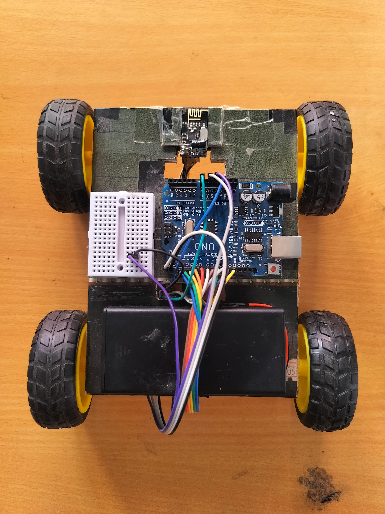
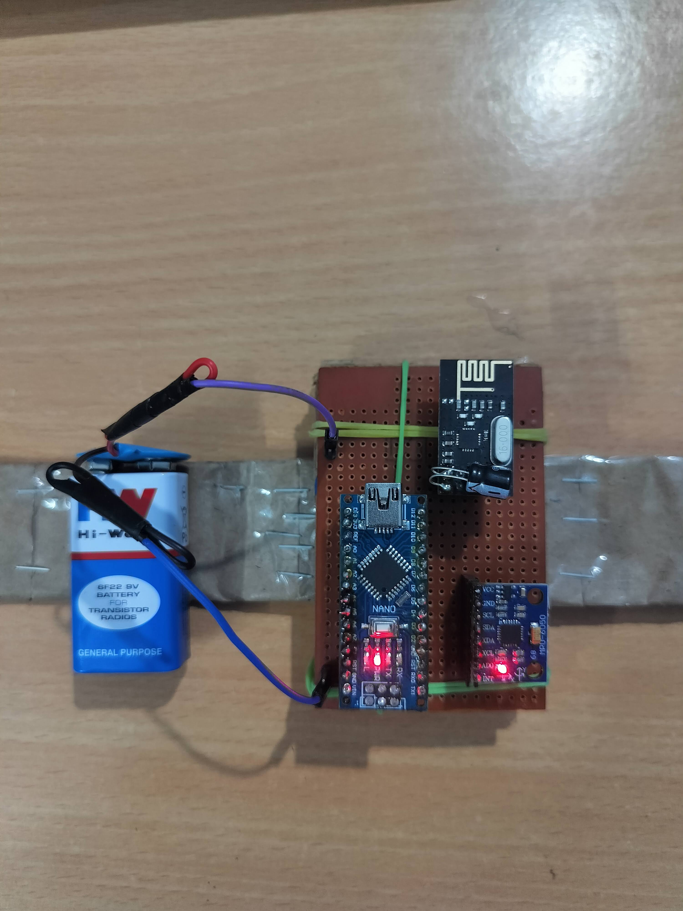
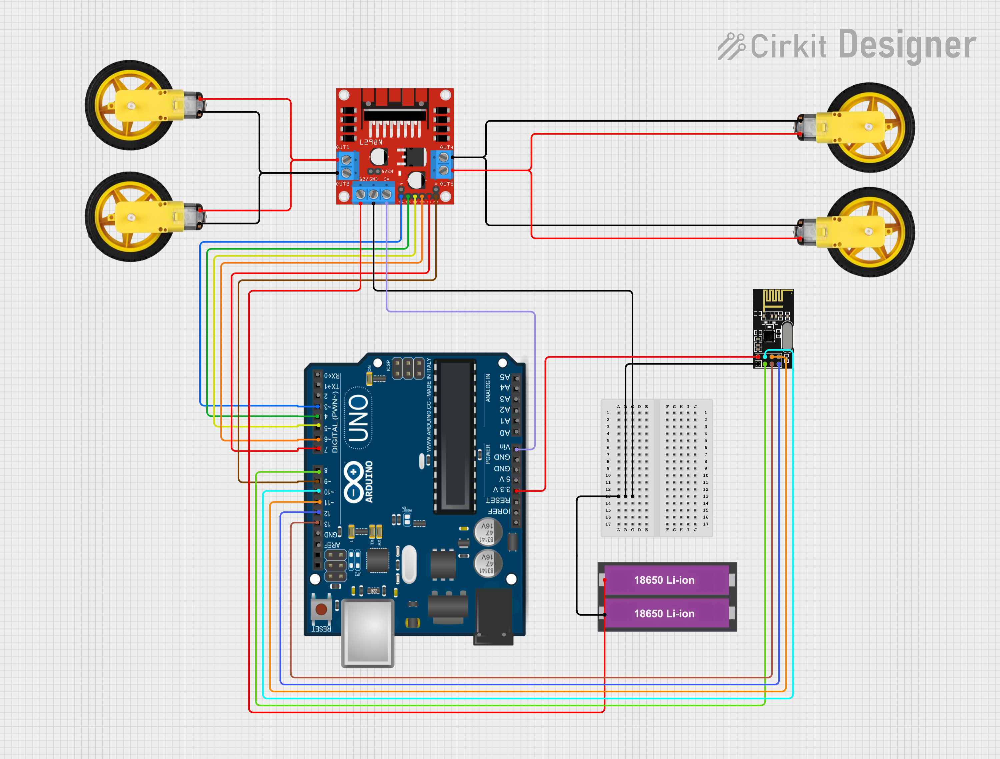
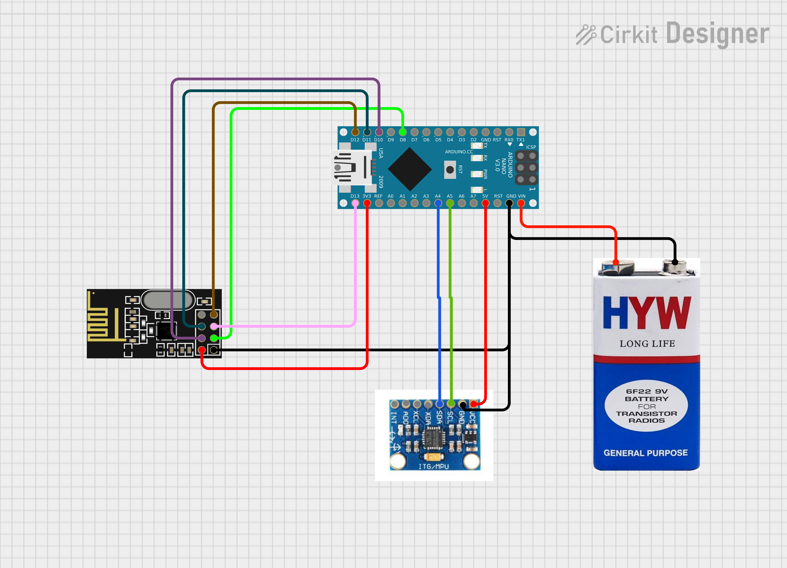

# 🚗 Gesture-Controlled Robot Car

## 📌 Overview

This project implements a wireless gesture controlled robot car using an Arduino Nano based transmitter and an Arduino Uno based receiver. Hand gestures are detected using an MPU6050 accelerometer and gyroscope sensor, transmitted wirelessly through NRF24L01 transceiver modules, and used to control the movement of the robot car.

The system provides an intuitive and cable-free control mechanism by converting hand tilts into motion commands such as forward, backward, left, right, and stop.

---

## ✨ Features

* Wireless gesture based control
* Real time motion detection using MPU6050
* NRF24L01 RF communication
* Forward, Backward, Left, Right movement
* Operating range up to 50–100 meters in open areas
* Stop command when hand returns to neutral position
* Separate transmitter and receiver modules

---

## 🛠 Components Used

### Receiver Unit (Robot Car)

| Component                   | Quantity    |
| --------------------------- | ----------- |
| Arduino Uno                 | 1           |
| NRF24L01 Transceiver Module | 1           |
| L298N Motor Driver          | 1           |
| DC Gear Motors              | 4           |
| Wheels                      | 4           |
| 18650 Li-ion Batteries      | 2           |
| Jumper Wires                | As Required |

### Transmitter Unit

| Component                         | Quantity    |
| --------------------------------- | ----------- |
| Arduino Nano                      | 1           |
| MPU6050 Accelerometer & Gyroscope | 1           |
| NRF24L01 Transceiver Module       | 1           |
| 9V Battery                        | 1           |
| Perfboard                         | 1           |
| Jumper Wires                      | As Required |

---

## ⚙️ Working Principle

1. The MPU6050 detects the tilt of the user's hand.
2. The Arduino Nano processes the sensor data.
3. Corresponding motion commands are transmitted through the NRF24L01 module.
4. The receiver NRF24L01 receives the commands.
5. Arduino Uno controls the L298N motor driver.
6. The robot car moves according to the detected gesture.

---

## 🔌 Receiver Pin Configuration

### L298N Motor Driver ↔ Arduino Uno

| Arduino Pin | L298N Pin | Function                        |
| ----------- | --------- | ------------------------------- |
| D3          | ENA       | Left Motor Speed Control (PWM)  |
| D4          | IN1       | Motor Direction 1               |
| D5          | IN2       | Motor Direction 2               |
| D6          | IN3       | Motor Direction 3               |
| D7          | IN4       | Motor Direction 4               |
| D9          | ENB       | Right Motor Speed Control (PWM) |

### NRF24L01 ↔ Arduino Uno

| NRF24L01 Pin | Arduino Uno Pin |
| ------------ | --------------- |
| VCC          | 3.3V            |
| GND          | GND             |
| CE           | D8              |
| CSN          | D10             |
| SCK          | D13             |
| MOSI         | D11             |
| MISO         | D12             |

---

## 🔌 Transmitter Pin Configuration

### MPU6050 ↔ Arduino Nano

| MPU6050 Pin | Arduino Nano Pin |
| ----------- | ---------------- |
| VCC         | 5V               |
| GND         | GND              |
| SDA         | A4               |
| SCL         | A5               |

### NRF24L01 ↔ Arduino Nano

| NRF24L01 Pin | Arduino Nano Pin |
| ------------ | ---------------- |
| VCC          | 3.3V             |
| GND          | GND              |
| CE           | D8               |
| CSN          | D10              |
| SCK          | D13              |
| MOSI         | D11              |
| MISO         | D12              |

---

## 📷 Receiver Model

---

## 📷 Transmitter Model

---

## 🎥 Demo Video

Watch the demo video here:

[⏯️Click Here](https://drive.google.com/file/d/1ON1rfQM93CCP-XdOsEhf0PfyDz6VQX9T/view?usp=drive_link)

---

## 🔌 Receiver Circuit Diagram

---

## 🔌 Transmitter Circuit Diagram

---

## 👨‍💻 Author

**Tushar Kanti Sahariah**
